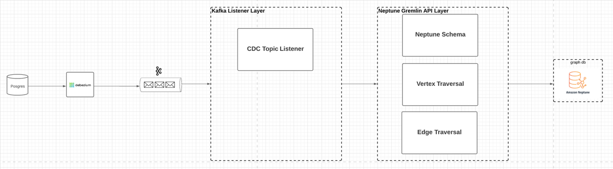
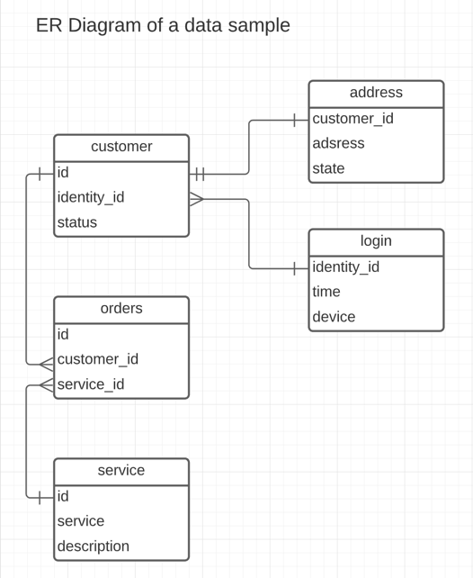

## kafka-neptune-sink-opensource

This is a standalone service that listens to kafka events messages and writes those messages to Neptune db according to predefined schema.

# Setup

High Level Architecture of the service:
- Batch listener to the Kafka topics
- User-defined Neptune Schema
- Gremlin API for creation of Vertices/Edges in Neptune db

How to use this service?
- Update the application properties with your own MSK cluster and Neptune cluster endpoints
- Define your own Neptune Schema
- Build the project using gradle
- Deploy the executable build to your server
- Meet the following server requirements:
    1. Java 1.8 or higher
    2. Tomcat web application server needed to start this SpringBootApplication service
    3. Server must be located in the same VPC as your Neptune DB (restrictions imposed by AWS)
    
    
# Define Neptune Schema

Neptune schema serves only one purpose - to define the relationships between the vertices (nodes) in the Neptune DB.
Here at Varo we cdc all changes (inserts/updates/deletes) to the data in the Postgress DB to the respective Kafka topics as a JSON messages. The data already has such relationships defined in the source - Postgress DB schema. Lets take a look at the below DB schema:

In the relational DB you define the relationships between tables on the table level using primary/foreign keys as the connection rules for each record that exists in the relational DB tables.
Relationships between vertices (nodes) in Neptune are conceptually different - they are real physical relationships between each record. Such relationship can not be defined on a top level (entity level) and has to be created for each vertex record individually. Such design approach taken by Neptune and other graph DBs on one hand makes it more difficult writing data to the DB but on the other hand enables extremely fast read queries from the DB.

This service simplifies the work needed to create the relationships between vertices. In the below schema we define exactly the same relationships between entities as in the ER Diagram above (as table level relationships) and delegate the work of creating the relationships between the individual records to this service.
In addition to the relationships between entities the schema below also has the mapping between the source (kafka_topic) and the destination in Neptune DB (vertex).

    schema:
      - vertex: cdc.customer.customer      # name of the vertex in the Neptune DB
        kafka_topic: cdc.customer.customer # name of the kafka topic
        prefix: customer_                  # adds prefix to the vertex id to ensure the id uniqueness across all vertices
        id: id                             # unique id (primary key) in customer entity
        child:
          - vertex: cdc.login.login
            kafka_topic: cdc.login.login
            prefix: login_
            id: identity_id               # unique id (primary key) in login entity
            ref_key: identity_id          # reference key (similar to foreign key) that links login entity to customer entity
            parent_prop_key: identity_id  # property key in customer entity to which the the login entity is linked to
            edge_label: logged            # label of the edge (link) between login and customer entities
          - vertex: cdc.address.address
            kafka_topic: cdc.address.address
            prefix: address_
            id: customer_id               # unique id (primary key) in address entity
            ref_key: customer_id          # reference key (similar to foreign key) that links address entity to customer entity
            parent_prop_key: id           # property key in customer entity to which the the address entity is linked to
            edge_label: address
          - vertex: cdc.orders.orders
            kafka_topic: cdc.orders.orders
            prefix: orders_
            id: id                        # unique id (primary key) in orders entity
            ref_key: customer_id          # reference key (similar to foreign key) that links orders entity to customer entity
            parent_prop_key: id           # property key in customer entity to which the the orders entity is linked to
            edge_label: orders
            child:
              - vertex: cdc.service.service
                kafka_topic: cdc.service.service
                prefix: service_
                id: id                        # unique id (primary key) in service entity
                ref_key: id                   # reference key (similar to foreign key) that links service entity to orders entity
                parent_prop_key: service_id   # property key in orders entity to which the the service entity is linked to
                edge_label: service

# Test locally with Gremlin server

Use the application-integrationtest.yaml that has required properties and test Neptune schema to run the integration test NeptuneWriterIntegrationTest.

To run the integration tests locally you will need to have docker container and Java 1.8. The test will automatically pull the Gremlin container image and connect to the gremlin server.

*Gremlin server has slight difference from Neptune DB: vertex/edge id can only be an Integer in the Gremlin server; Neptune db can have a String. Because of this limitation, test Neptune schema is slightly different from the one in application.yaml that should be used for writing data to Neptune db. Test Neptune schema must have "prefix" property set as empty for every vertex.

# License Summary

This code is made available under a BSD-2 license. See the LICENSE file. (NEEDS LEGAL REVIEW!)